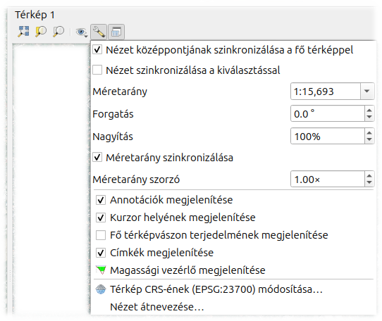

Térképtémák használata
======================

QGIS 3.10+ verzió

Összeállította: Siki Zoltán

A térképtémák segítségével egy.egy térkép nézet ablakban a rétegek láthatóságát 
(ki-, bekapcsolását) tudjuk megőrizni és gyorsan váltani azok között.
A témákat a réteg panelben felül látható szem ikon segítségével kezelhetjük.

Az első térkép téma hozzáadása előtt állítsuk be a réteg panelban a rétegek
láthatóságát. A példánkban csak két ortofotó réteg szerepel és két témát hozunk
létre. A *Téma1* témában csak az első, a *Téma2* témában csak a második réteg 
látható.

Ezután A térképtémák kezelése (szem) ikon felbukkanó menüjében megjelenik a
két térképtéma, melyek közül választva gyorsan válthatunk a rétegek 
beállított láthatóságai között. 

A térképtémák használatának további lehetősége nyílik meg, ha több 
térképnézetet használunk. Az egyes térképnézetekben eltérő térképtémákat
használhatunk, sőt a további térképnézeteket a fő nézethez kapcsolhatjuk oly
módon, hogy a második térképnézet középpontja és méretaránya megegyezzen
a fő nézetével. Így az egyik térképnézetben navigálva a másik térképnézet 
követi megjelenített részt.

Hozzunk létre egy új 2D térképnézetet a **Nézet/Új térképnézet** menüponttal
és dokkoljuk azt a fő nézet mellett. A *térkép 1* nézetablakban a szem ikon
egy szűkített menüt hoz fel, itt csak a térképtémák közül választhatunk, 
alapértelmezésben az új nézet rétegbeállításai követik a rétegpanelben lévő
láthatósági beállításokat. A fő ablakban válasszuk ki a *Téma1*-et, a 
*Térkép 1* nézetablakban pedig a *Téma2*-öt.

Ahhoz, hogy a két nézetablakban szinronizáltan mozgathassuk a térképi tartalmat
a *Térkép 1* ablakban a csavarkulcs ikonnal állítsuk be a
*Nézet középpontjának szinkronizálása a fő térképpel* és a *Méretarány
szinkronizálása* opciókat.

Ezután bármelyik nézetben nagyítunk vagy mozgatjuk a térképet, a másik nézet
követni fogja azt.

2025. február 14.
