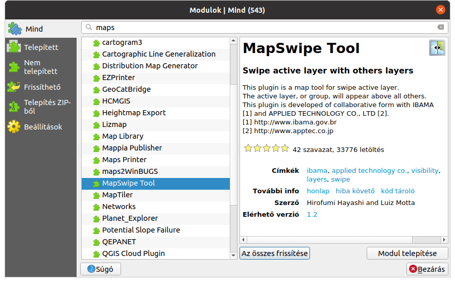

Hasznos modulok
===============

Ebben a leírásban néhány hasznos modult ismertetünk, a teljesség igénye nélkül.
A QGIS modulok gyűjtőhelyén jelenleg 543 modul található a QGIS 3 verzióhoz, 
melyeket a QGIS
felhasználók készítettek és töltöttek fel a http://plugins.qgis.org oldalra.
Ezek közül választottam néhányat. De először a kezdőknek egy kis segítség a
modulok telepítésével kapcsolatban.

Modulok telepítése
------------------

A QGIS menüből a Modulok/Modulok kezelése és telepítése... menüponttal
kezdhetjük újabb modul telepítését, bekapcsolását illetve eltávolítását.

Egy modulnak három állapota lehet *nem telepített*, *telepített*, *aktív*.
A telepített modulokat tehetjük aktívvá, ekkor a QGIS betölti a modul kódját
és a modul felhasználói felülete megjelenik (ikon, menüpont, panel).

Egy másik szempont szerint belső ás külső modulokat különböztethetünk meg. 
A belső modulokat a QGIS fejlesztők tartják karban, azok a QGIS telepítésével
együtt kerülnek a gépünkre és nem tudjuk eltávolítani őket. A külső modulokat
a QGIS felhasználók készítik ezeket egyesével telepíthetjük és eltávolíthatjuk.
A külső modulokhoz csak kívételes esetben van magyar felhasználói felület,
általában angol üzenetekkel találkozhatunk.

A modulok között csak az aktuális QGIS verzióban használható modulok jelennek 
meg, ezek közül is azok, melyek a fejlesztő szerint stabilan működnek. A
kísérleti modulok megjelenítését a beállítások fülön kapcsolhatjuk be.
Itt a hivatalos QGIS modul tárház mellett továbbiakat is hozzáadhatunk (pl.
az Oslandia cég üzemeltett saját modul tárolót).

.. figure:: images/hasznos_modulok2.png
		:align: center

Új modul telepítéséhez válasszuk az **Mind** vagy a **Nem telepített** fület.
Célszerű a felső keresés mezőbe begépelni legalább részben a modul nevét, egy
rövidebb listában kelljen keresgélnünk.
A listából egy modulra kattintva a jobb oldalon rövid angol leírás 
illetve linkek jelennek meg. A felhasználók értékelését (csillagok) és a
letöltések számát is láthatjuk. A modul telepítés gomb megnyomásával települ
a gépünkre a modul. A telepített modul előtt egy jelölő négyzet jelenik, 
mellyek aktívvá tehetjük a modult

Ezután néhány modul ismertetése következik.

Map Swipe Tool
--------------

**FIGYELEM**

*A QGIS 2.26 (illetve Qt 5.15) verziótól a modul egy hibával elszáll, melynek kijavítását továbbítottam a fejlesztőknek, de eddig nem vették figyelembe, lásd: https://github.com/lmotta/mapswipetool_plugin/pull/17.*

Akinek rendszeresen űrfelvételeket, ortofotókat kell összehasonlítania, nagyon
hasznos lehet a **MapSwipe** modul. Vízszintesen vagy függőlegesen mozgathatunk
egy vonalat a felső réteg eltakarásához vagy megjelenítéséhez.

A modul telepítése után a modulok menüből illetve eszközsorból érhető el a 
modul. Először a felső ortofotó/űrfelvétel legyen az aktív réteg és nyomjuk be a
modul ikonját az eszközsorban vagy a menüből válasszuk ki. Az aktív réteg 
láthatóságát kikapcsolja a modul. Kattintsunk a térképre és nyomva tartott 
egér gombbal kezdjük belra-jobbra vagy le-fel húzni az egeret. Az egér gomb 
elengedése után újra kattintva módosíthatjuk a húzás irányát.

Nem csak rétegekre, hanem réteg csoportokra is lehet alkalmazni. Az alábbi
képen két WMS réteg esetét mutatja. A modul vektor réteghez is használható.

.. figure:: images/hasznos_modulok1.png
		:align: center

StreetView
----------

A **StreetView** modul segítségével a QGIS-ből jeleníthetjük meg a Google 
StreetView képeket. A térképünk tetszőleges vetületi rendszerben lehet. 
A SteertView  modult a *Modulok* menüben találjuk illetve az ikonját a *Modulok*
eszköztárban. Válasszuk ki az emberke ikont, kattintsunk a térképbe és az
egérgomb nyomvatartása mellett húzzunk ki egy vonalat. A kattintás pozíciója
adja meg a nézőpontunkat, a kihúzott egyenes pedig azt, hogy merre nézünk.
A modul egy új böngésző ablakot nyít, melyben a Google StreetView megfelelő 
részlete látszódik. A megnyiló böngésző ablakban a szokásos módon használhatjuk
a Google StreetView alkalmazást.

.. figure:: images/hasznos_modulok4.png
		:align: center

.. figure:: images/hasznos_modulok5.png
        :align: center

Profile tool
------------

**MEGJEGYZÉS**

*A Profile tool modul funkcionalitása a QGIS 3.26 verziótól bekerült az alapprogramba és új funkciókkal bővült. A profile tool modult távolítsa el a 3.26 vagy újabb verzióban és a Nézet/Szintmetszet menüpontot használja.*

A **Profile tool** modullal szabályos négyzetrácsban elrendezett magasságok
(vagy egyéb adatok) metszetét készíthetjük el. A telepítés után a modult a
Raszter menüben illetve a Modulok eszköztárban találhatjuk meg.

A modul ikonjának megnyomása után a térkép alatt egy új panel jelenik meg.
A panel három fület tartalmaz: *Profile* (metszet), *Table* (táblázat),
*Settings* (beállítások).
A modul felhasználói felülete angol nyelvű. 

Fedezzük fel először a *Profile* fület.
Először a jobb oldalon az **Add layer gomb** megnyomásával az aktuális réteget
adhatja a listához. Ez egy domborzatot tartalmazó réteg legyen. 
A piros téglalap a metszetvonal színét mutatja.
A piros téglalapba kattintva módosíthatjuk a színt. A metszetet egy törvonallal
adhatja meg a térképablakban az egérrel kattintva. A metszet utolsó pontjában
dupla kattintással zárhatja le a rajzolást. A metszet rajzolás az előző 
metszetet automatikusan törli. A réteglista alatti beállítások (**Options**)
részben a Selection utáni listából választva egy rétegből kiválasztott 
törtvonal mentén (**Selected polyline**) vagy egy réteg összes vonala mentén
(**Selected layer**) készít metszetet a modul. A **Show cursor** jelölő
négyzet kiválasztása azt jelenti, hogy a bal oldali metszetben mozgatva az
egeret, az egérrel jelölt pont távolságát a metszet kezdetétől (X) és a 
magasságot (Y) kiírja a modul. A **Link mouse position on graph
with canvas** opció kiválasztása esetén a metszeten mozgatott egérrel együtt
mozog egy kis négyzet a metszet mentén a térkép ablakban.
A metszet alatt a **Heigth** (magasság) melett a lejtő meredekségének 
százalékos (Slope %) vagy fokokban (Slope\ :sup:`o`). Az **Interpolated 
profile** (interpolált metszet) kikapcsolása esetén csak a megadott 
törtvonal végpontjai jelennek meg a metszetben. A **Save as** gombbal a
metszetet különböző formátumokba menthetjük el (Graph - PNG, Graph - SVG,
3D Line - DXF, 2D profile - DXF). A **maximum** és **minimum** mezőkkel a
metszet függőleges terjedelmét módosíthatjuk. Az eredeti értékeket a 
**Reset view** gombbal állíthatjuk vissza.

A *Table* fülön a metszet pontjait táblázatos formában láthatjuk. Emellett
különböző formátumban a vágólapra vagy ideiglenes rétegbe (pontok)
tehetjük át a metszet adatait.

Clip multiple layers
--------------------

Kivágat készítése a látható vektor és raszter rétegekből. A modul elindítása 
előtt létre kell hozni egy felület (polygon) réteget a vágó idommal.
Ezt legkönnyebben egy ideiglenes réteg létrehozásával tehetjük meg.
Az ideiglenes rétegen hozzunk létre egy új felület elemet.

A réteg kivágatok a megadott könyvvtár *vector* és *raster* alkönyvtáraiba kerülnek.
