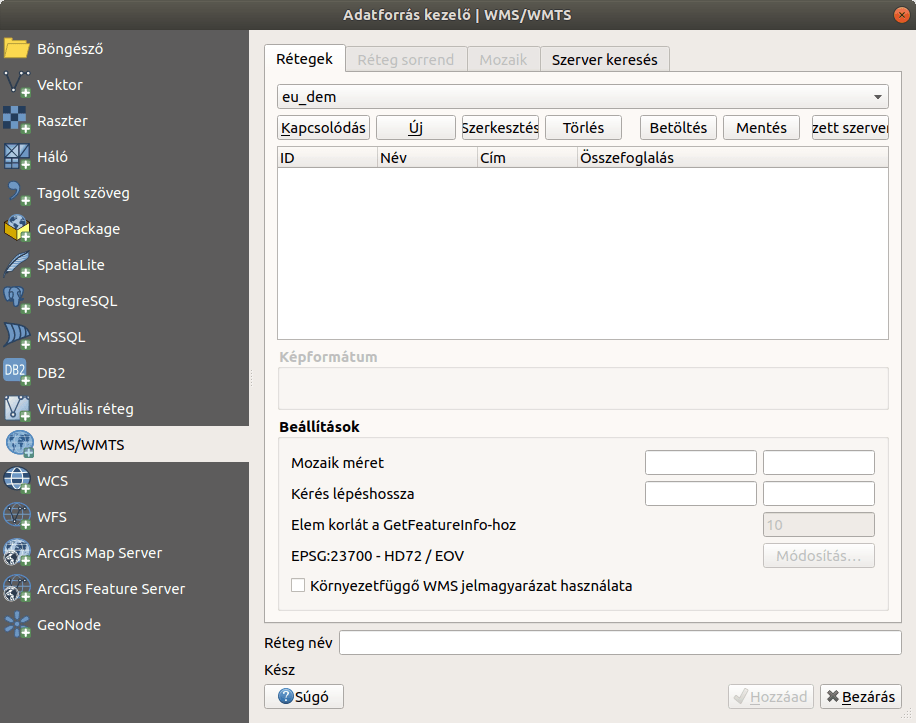

Nyilvános térképek elérése QGIS-ből
===================================

3.x verzió

Összeállította: Siki Zoltán

A nyilvános térképeket az interneten általában szabványos WMS vagy WMTS (csempe)
szolgáltatásként publikálják. A QGIS mindkét szolgáltatás használatára alkalmas.
Sőt katalógus szolgáltatásokat is használhatunk a térképek metaadatainak böngészésére.

WMS szerver beállítása a QGIS-ben
---------------------------------

Nyissuk meg az adatforrás kezelőt |wms_szolg1_png| vagy a menüből válasszuk a
**Réteg->Réteg hozzáadása->WMS/WMTS hozzáadása…** opciót. A **WMS/WMTS** fülön nyomjuk meg az **Új** gombot .

|wms_szolg2_png|

A megjelenő párbeszédablakban a **Név** és **URL**
mezőt kell kitölteni. A nyilvános szolgáltatásoknál nincs hitelesítés.
A név mezőben egy tetszőleges nevet adhatunk meg a szolgáltatáshoz. Az URL mezőben a szolgáltatótól kapott internetes címet kell beírni, ez sokszor elég hosszú és célszerű a vágólapon keresztül bemásolni a mezőbe.

.. note:: Megjegyzés:

	A WMS szolgáltatás neve alatti gombok közül az utolsóval néhány nemzetközi WMS szervert adhatunk a QGIS-hez: GoeServer Demo, MapServer Demo, QGIS Server Demo – Alaska.

	A **Mentés** gombbal egy fájlba írhatjuk ki a WMS beállításokat, amiket egy másik gépen a **Betöltés** gombbal betölthetünk.

|wms_szolg3_png|

Az adatok megadása után nyomja meg az **OK** gombot.
A kapcsolat beállításait a QGIS megjegyzi, azt nem kell ismételtem megadnunk, csak a listából kell kiválasztani.

Az adatforrás kezelőben a WMS/WMTS fülön megjelenik az új kapcsolat neve a legördülő listában. A **Kapcsolódás**
gomb megnyomásával megkapjuk az elérhető rétegek listáját.

.. note:: Megjegyzés

	A szerver keresés fülön megadhatunk egy kereső kifejezést, amihez a program megpróbál WMS/WMTS szolgáltatásokat keresni.

|wms_szolg4_png|

A réteglistából egy vagy több réteget is kiválaszthatunk, melyeket egy raszteres rétegként kapunk meg a QGIS-ben. A nulla (0) azonosítójú réteg az összes a listában szereplő réteg együttes beillesztését jelenti.
A szolgáltatás beállításának függvényében választhatunk képformátumot (PNG,PNG8, stb.) és vetületi rendszert.
A beállítások megadása után a **Hozzáad** gombot kell megnyomni.
Ugyanarról a szerverről több önálló réteget adhatunk a QGIS projektünkhöz, ha a fenti lépést megismételjük.

A QGIS-ben a WMS réteghez korlátozott funkcionalitás kapcsolódik, nem tudjuk szerkeszteni őket, nem tudjuk megnyitni az adatbázis táblát, a forrás oldalon vektorként tárolt rétegekre egyesével lekérdezhetjük az attribútumokat, („i” ikon) ha a szerver üzemeltetője engedélyezte ezt.

Csempe (XYZ) szerver beállítása QGIS-ben
----------------------------------------

A csempe szervereket a Böngésző panelben állíthatjuk be.
Keressük meg a böngésző ablakban az **XYZ Tiles**
csoportot. Kattintsunk a csoport nevére a jobb egérgombbal és a felbukkanó menüből válasszuk az **Új kapcsolat…** menüpontot.

|wms_szolg5_png|

A megjelenő párbeszédablakban a WMS kapcsolathoz hasonlóan egy nevet és egy URL-t kell megadnunk. A csempe szervereknél az URL-ben szerepel a {x}, {y} és {z} speciális részek, melyeket a kliens a hely függvényében dinamikusan tölti ki.

|wms_szolg6_png|

A csempe szolgáltatás beállítása után a az XYZ tiles csoport szétnyitható és az egyes beállított csempe szolgáltatások megjelennek. Az egyes csempe rétegeket az egérrel húzzuk át a réteg panelra vagy a térkép vászonra, hogy a réteget hozzáadjuk a projekthez.

.. note:: Megjegyzés

	A csempe szolgáltatásokat a **QuickMapServices** (QMS) modulból is elérhetünk.
	A QMS modulban csempe szolgáltatásokat kereshetünk címszavak alapján. Lásd a QMS modul leírásában:
	`http://www.agt.bme.hu/gis/qgis/qms.pdf <http://www.agt.bme.hu/gis/qgis/qms.pdf>`_

Magyar Bányászati és Földtani Szolgálat (MBFSZ) térkép szervere (https://map.mbfsz.gov.hu)
~~~~~~~~~~~~~~~~~~~~~~~~~~~~~~~~~~~~~~~~~~~~~~~~~~~~~~~~~~~~~~~~~~~~~~~~~~~~~~~~~~~~~~~~~~

======================== ===================================================================================================
        NÉV                      URL
======================== ===================================================================================================
Furáspontok              https://map.mbfsz.gov.hu/arcgis/services/public/map_furaspont_wm/MapServer/WMSServer?version=1.3.0
Földtani térkép          https://map.mbfsz.gov.hu/arcgis/services/fdt100/fdt_100/MapServer/WMSServer?version=1.3.0
Földtani atlasz          https://map.mbfsz.gov.hu/arcgis/services/atlasz200/atlasz200/MapServer/WMSServer?version=1.3.0
Földtani térkép          http://map.mbfsz.gov.hu/arcgis/services/mfdt500_en/mfdt500_en/MapServer/WMSServer?version=1.3.0
Mélyföldtani térkép      http://map.mbfsz.gov.hu/arcgis/services/mfdt500_en/mfdt500_en/MapServer/WMSServer?version=1.3.0
Pre-kainozoos            https://map.mbfsz.gov.hu/arcgis/services/preterc500/preterc500/MapServer/WMSServer?version=1.3.0
Potenciális hull.lerak   https://map.mbfsz.gov.hu/arcgis/services/pothull100/pothull100/MapServer/WMSServer?version=1.3.0
Talajvízszint 0-8m       https://map.mbfsz.gov.hu/arcgis/services/tvz100/tvz100_1248_tem/MapServer/WMSServer?version=1.3.0
Talajvízszint 0-20m      https://map.mbfsz.gov.hu/arcgis/services/tvz100/tvz100_251020_tem/MapServer/WMSServer?version=1.3.0
======================== ===================================================================================================

Lechner Tudásközpont WMS szolgáltatásai (http://api.lechnerkozpont.hu)
~~~~~~~~~~~~~~~~~~~~~~~~~~~~~~~~~~~~~~~~~~~~~~~~~~~~~~~~~~~~~~~~~~~~~~

======================== ===================================================================================================
        NÉV                      URL
======================== ===================================================================================================
Védett természeti ter.   http://gis.teir.hu/arcgis/services/TeIR_GIS/teirgis_termeszetvedelem/MapServer/WMSServer
Működő és felh. bányák   http://gis.teir.hu/arcgis/services/TeIR_GIS/teirgis_banyaszat/MapServer/WMSServer
Villamosenergia rendsz.  http://gis.teir.hu/arcgis/services/TeIR_GIS/teirgis_mavir_halozat/MapServer/WMSServer
Hulladéklerakók          http://gis.teir.hu/arcgis/services/TeIR_GIS/teirgis_hulladeklerakok/MapServer/WMSServer
Ipari parkok             http://gis.teir.hu/arcgis/services/TeIR_GIS/teirgis_ipariparkok/MapServer/WMSServer
Közlekedési hálózat      http://gis.teir.hu/arcgis/services/TeIR_GIS/teirgis_kozlekedes_2014/MapServer/WMSServer
Természeti környezet     http://gis.teir.hu/arcgis/services/TeIR_GIS/teirgis_termeszeti_kornyezet/MapServer/WMSServer
Ivóvízminőség            http://gis.teir.hu/arcgis/services/TeIR_GIS/teirgis_ivoviz/MapServer/WMSServer
Kőolaj- és gázvezetékek  http://gis.teir.hu/arcgis/services/TeIR_GIS/teirgis_koolaj_foldgaz_banyaterulet/MapServer/WMSServer
Budaörs szab. terv.2016  http://gis.lechnerkozpont.hu/publiclayers/wms?MAPFILE=ATADAS20180405/Budaors/03_Szabalyozasi_terv/Budaors_SZT_terv_20160226_v01_tr_eov.map
budaörsi szab.tervek     http://gis.lechnerkozpont.hu/publiclayersOrszágos területrendezési tervhttps://oeny.e-epites.hu/geoserver/otrt-4tr/ows?service=wms&version=1.3.0
Budapest aggl. terve     https://oeny.e-epites.hu/geoserver/ba-4tr/ows?service=wms&version=1.3.0
Balaton kiemelt körzet   https://oeny.e-epites.hu/geoserver/bku-4tr/ows?service=wms&version=1.3.0
======================== ===================================================================================================

Nyilvános csempe szolgáltatások magyarországi tartalommal
~~~~~~~~~~~~~~~~~~~~~~~~~~~~~~~~~~~~~~~~~~~~~~~~~~~~~~~~~

======================== ===================================================================================================
        NÉV                      URL
======================== ===================================================================================================
OpenStreetMap            https://tile.openstreetmap.org/{z}/{x}/{y}.png
Ortofotó 2005            http://e.tile.openstreetmap.hu/ortofoto2005/{z}/{x}/{y}.jpg
Ortofotó 2000            http://e.tile.openstreetmap.hu/ortofoto2000/{z}/{x}/{y}.jpg
Bing                     http://ecn.t3.tiles.virtualearth.net/tiles/a{q}.jpeg?g=1
Google satellit          http://www.google.cn/maps/vt?lyrs=s@189&gl=cn&x={x}&y={y}&z={z}
Google utak              https://mt1.google.com/vt/lyrs=h&x={x}&y={y}&z={z}
======================== ===================================================================================================

Katalógus szolgáltatások használata
-----------------------------------

Az interneten már vannak olyan szerverek, melyek metaadatokat szolgáltatnak térképekről. A QGIS **MetaSearch Catalog Client** modulja lehetőséget biztosít
*Catlog Service for the Web* (CSW) szervereken a keresésre. Ellenőrizze a
**Modulok-> Modulok kezelése és telepítése…** menüpont kiválasztása után a
**Telepített** fülön ellenőrizze, hogy a MetaSearch Catalog Client aktív-e.

|wms_szolg7_png|

A modul a **Web** menüből
érhető el. Használhatjuk a QGIS által kínált alapértelmezett katalógus szolgáltatásokat illetve az általunk ismert szolgáltatást is beállíthatjuk a WMS kapcsolathoz hasonlóan.

A MetaSearch modul ablakában válasszuk először a **Szolgáltatások**
fület és nyomja meg az **Alapértelmezett szolgáltatások hozzáadása**
gombot. Ez több mint 10 katalógus szolgáltatás beállításait adja a listához. A
**Szolgáltatás információ**
gombbal részletes információt kapunk szolgáltatásról.

|wms_szolg8_png|

Az általunk ismert új katalógus szolgáltatást a WMS szerverhez hasonlóan az
**Új** gomb megnyomása után adhatjuk a listához.
Számunkra szükséges térképeket, kulcsszavak alapján a **Keres**
fülön kereshetünk egy katalógusból.
Nem biztos, hogy a katalógusban megtalált térképeket az interneten mint WMS/WMTS is megtaláljuk.

|wms_szolg9_png|

Kattintsunk duplán a találati listába a részletes adatok megjelenítéséhez.

|wms_szolg10_png|

Alul, ha van Acces Link, akkor arra kattintva online térkép szolgáltatást érhetünk el, amihez általában WMS vagy WMTS szolgáltatás is elérhető.

Budapest, 2020. január 30.

.. |wms_szolg8_png| image:: images/wms_szolg8.png
    :width: 17cm
    :height: 10.809cm

.. |wms_szolg10_png| image:: images/wms_szolg10.png
    :width: 15.875cm
    :height: 11.377cm
