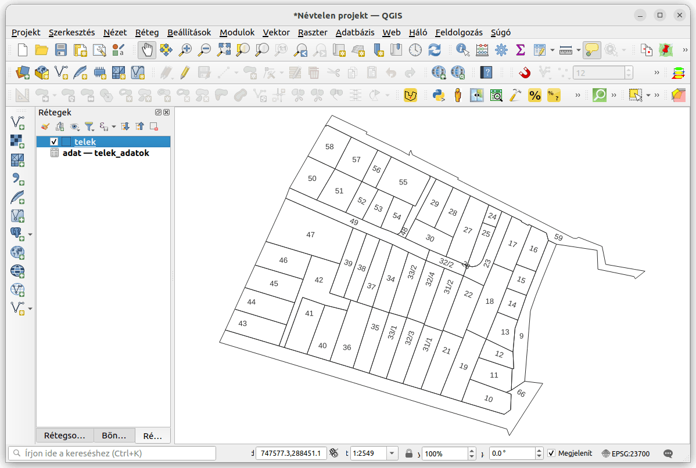
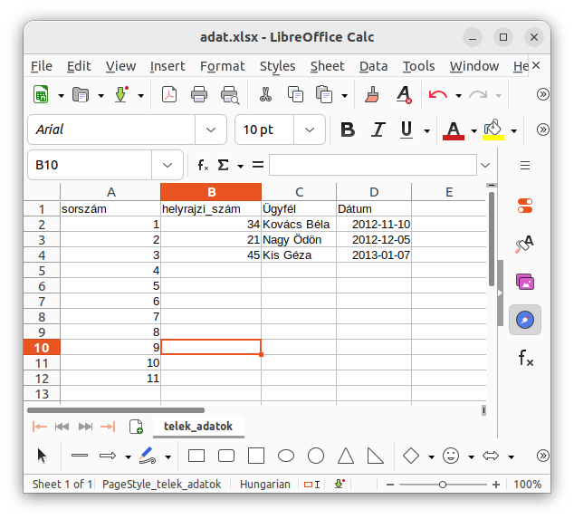
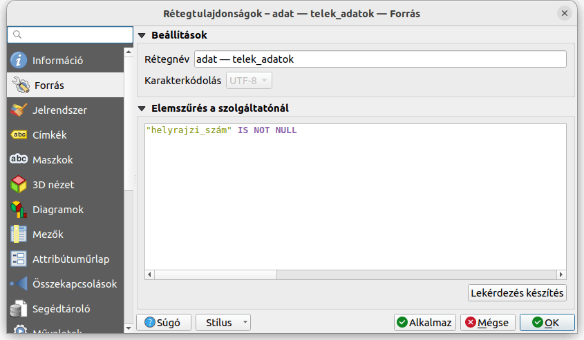
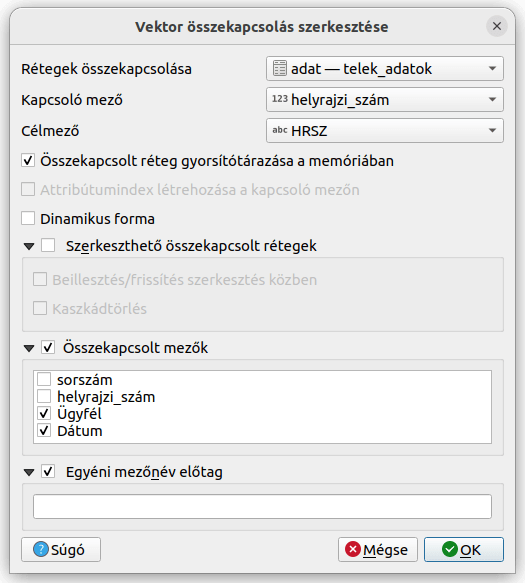
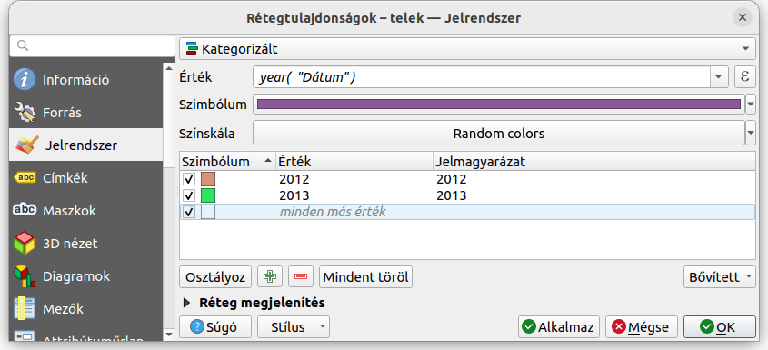
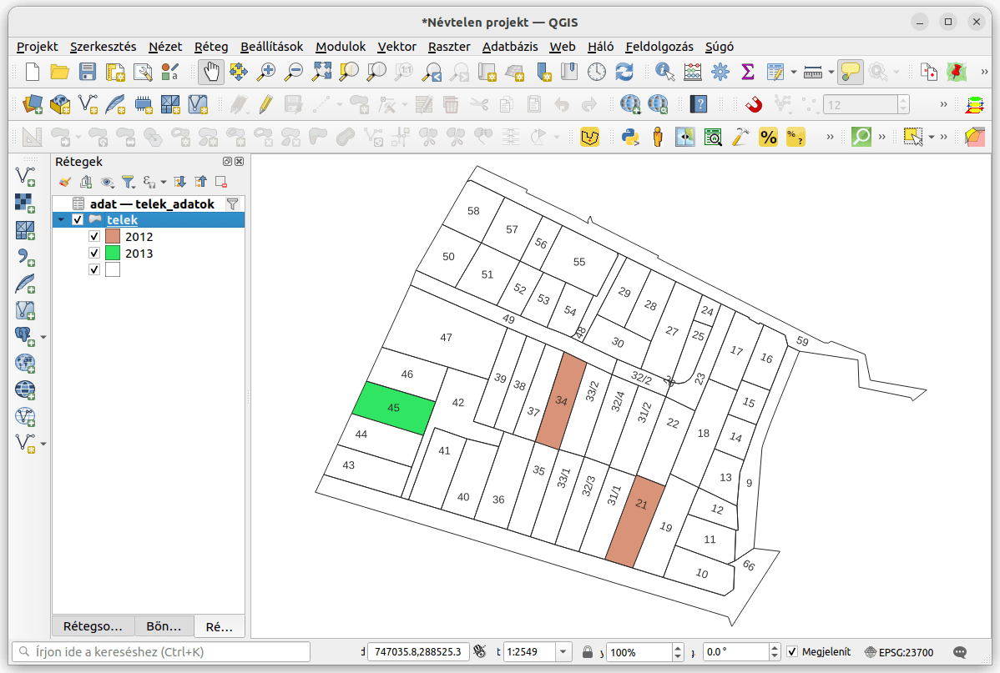

Excel táblázat hozzákapcsolása térképi réteghez
===============================================
3.16+ verzió

Összeállította: Siki Zoltán

Egy-egy egyszerűbb alfanumerikus adatokat tartalmazó táblázat kezelésére
hajlamosak vagyunk Excel táblázatokat használni. Amennyiben a táblázat
térképhez köthető adatokat is tartalmaz, akkor felmerülhet
az igény az adatok térképi megjelenítésére is. Ez az oktatóanyag erre mutat egy
példát, amikor az ingatlan-nyilvántartásban szereplő helyrajzi számokhoz
rendeljük az Excel állomány egyik fülén található adatokat.

Az Excel nem adatbáziskezelő, az Excelben szereplő adatok nem feltétlenül
felelnek meg a QGIS-ben történő megjelenítésnek. Néhány fontosabb szempont az
Excel állomány elkészítéséhez:

#. Egy Excel fülön szereplő (pl. Munka1, Munka2, stb.) adatokat kapcsolhatunk 
   egy QGIS réteghez.
#. Az Excel-ben "valódi" táblázatot készítsünk, minden sorban azonos számú
   mező legyen, kerüljük az összevont cellákat.
#. A táblázatnak legyen fejléc sora, kerüljük a speciális karakterek
   használatát a fejléc sorban (ezek lesznek az oszlopnevek a QGIS-ben),
   célszerű rövid oszlopneveket használni
#. Az Excel táblázatban kell egy olyan oszlop, melynek tartalma szerepel
   A QGIS réteg attribútum táblázatában (az oszlop neveknek nem kell
   megegyeznie, mint ahogy a példánkban sem.)

Kiinduló adatok
---------------

Egy a földrészleteket tartalmazó réteget (*telek.shp*) kapcsolunk hozzá az
*adat* nevű XLSX állomány *telek_adatok* nevű füléhez. Az állományok mérete
minimális, csak a bemutatás céljából jöttek létre.

Az Excel táblában csak néhány földrészletre van adat.

A mintaadatokat a következő linkek segíségével töltheti le:

* `telek.zip <data/telek.zip>`_
* `adat.xlsx <data/adat.xlsx>`_

Nyissuk meg mindkét állományt a QGIS-ben. Az XLSX állomány megnyitásához a 
*telek.shp* megnyitásához hasonlóan a vektor réteg hozzáadása műveletet kell
használnunk, de a fájl kiválasztásánál a fájtípust állítsuk át "Minden fájl"-ra
vagy "Minden támogatott fájl"-ra és keressük ki az XLSX állományt..
Amennyiben az Excel állomány több fület tartalmaz, egy következő 
párbeszédablakban ki kell választani a megfelelő Excel munkalapot is.

A QGIS Rétegek listában két elem jelenik meg a *telek* poligonokat tartalmazó 
és az *adat-telek_adatok* nevű réteg. Ez utóbbi elől hiányzik a ki-, 
bekapcsolást lehetővé tevő jelölőnégyzet. Ez azt jelenti, hogy a réteg 
nem tartalmaz geometriai (térképen megjeleníthető) adatokat.

Nyissuk meg a telek adatokat tartalmazó táblát, ez nyolc sort tartalmaz, mivel
a QGIS minden olyan sort átvesz, melyben legalább egy adat van.
Azokat a sorokat, melyben csak a sorszám oszlop tartalmaz adatokt, hagyjuk ki
a réteg tulajdonságai között a *Forrás* fülön.
A  *Lekérdezés készítés* gomb megnyomása után csak azokat a sorokat hagyjuk meg
ahol a helyrajzi szám nem üres. Ezt az SQL-ben az **IS NOT NULL** feltétellel adhatjuk meg.

Kapcsoljuk a *telek_adatokat* a *telek* réteghez, a rétegtulajdonságok 
*Összekapcsolások* fülén, a "+" nyomógomb megnyomása után.
Az összekapcsolás a HRSZ és helyrajzi szám oszlopok között jön létre 
(egyezőség esetén). Csak az *Ügyfél* és a *Dátum* oszlopok tartalmát 
vesszük át előtag nélkül.

Ezután a *telek* réteg attribútum táblájában megjelennek az XLSX táblázatban 
lévő adatok is, persze csak azoknál a telekeknél lesz érték, ahol egyezik a
helyrajzi szám.

A hozzákapcsolt mezők alapján is képezhetünk tematikus térképet, mondjuk
a dátum év része alapján.

Ez a térképen így jelenik meg.

